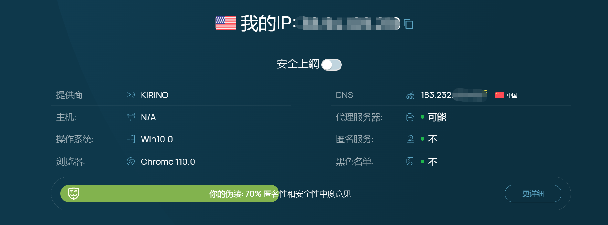
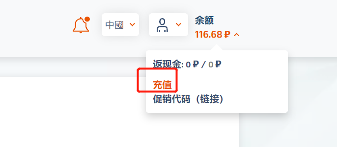
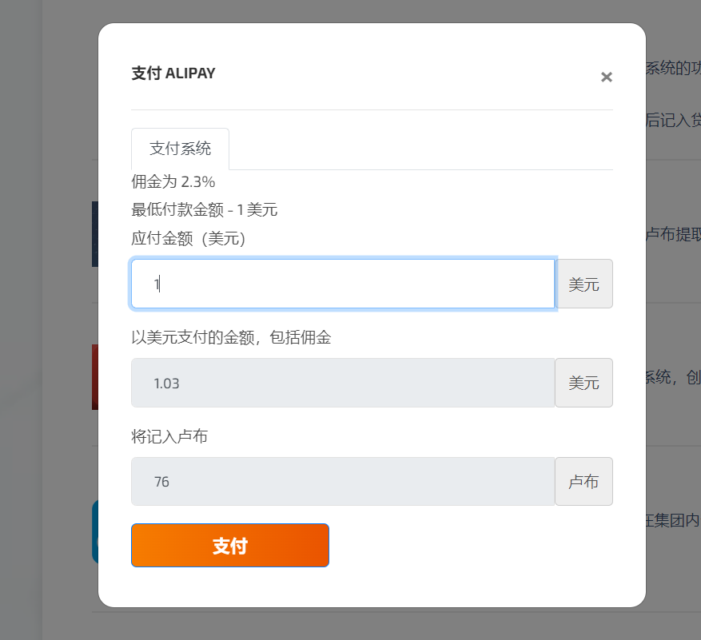
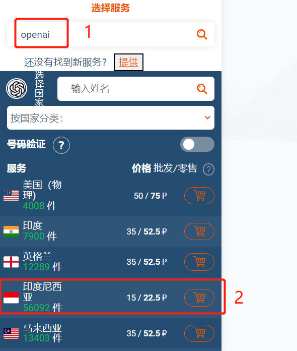
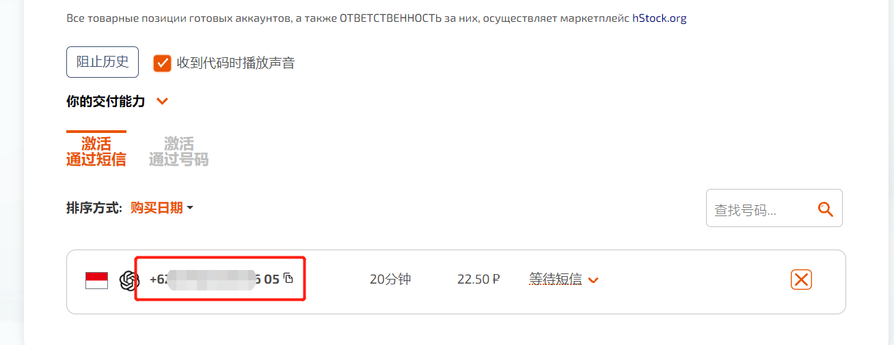
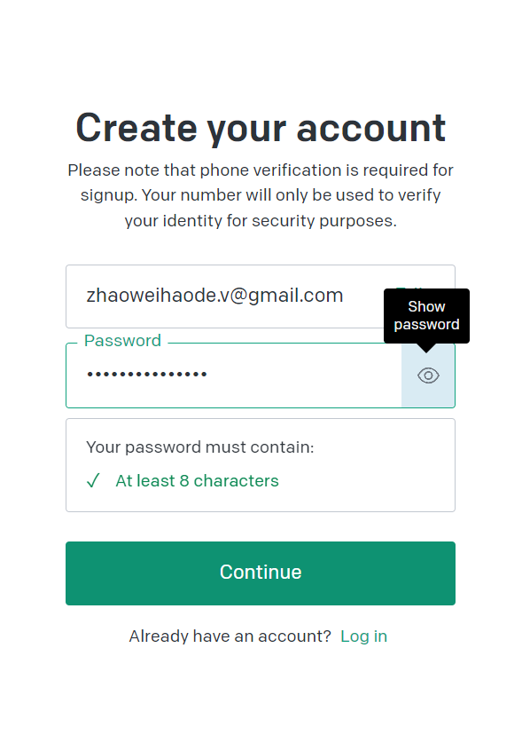
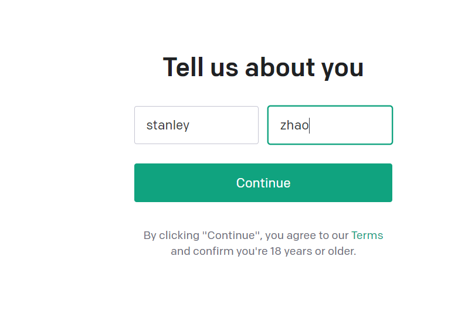
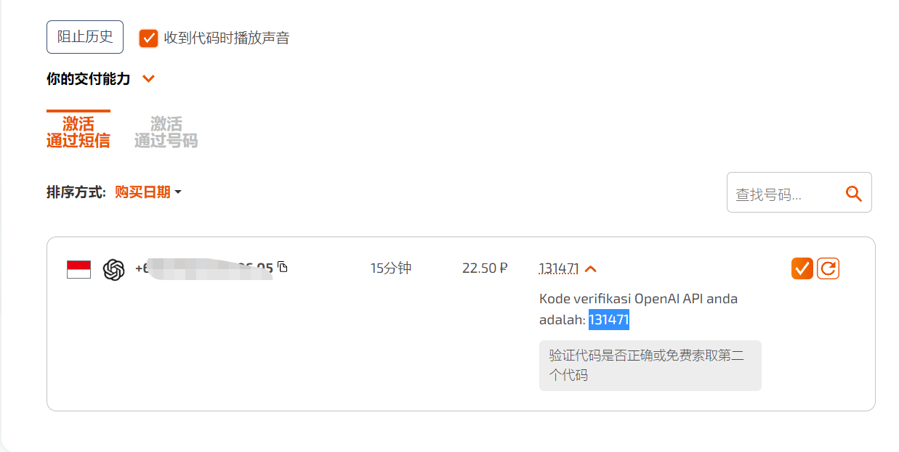
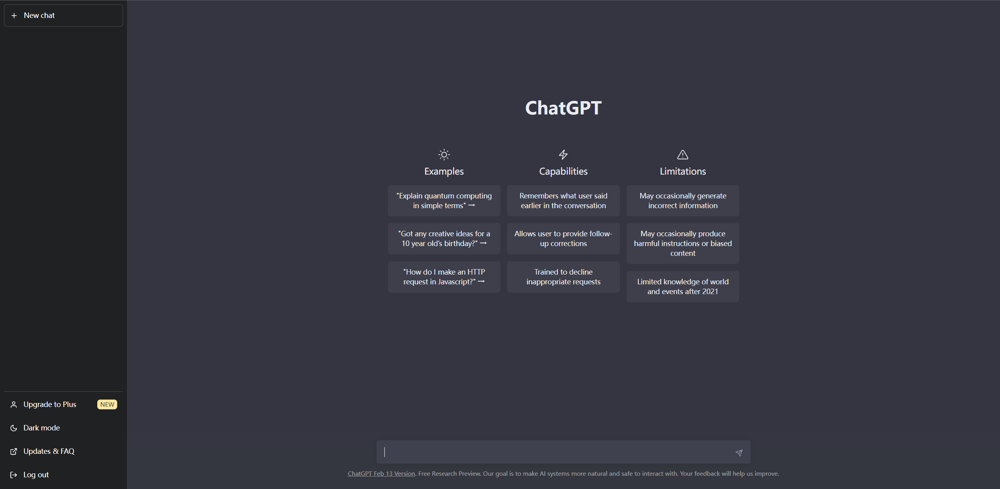

# 如何在国内注册ChatGPT账号

> 对文章有任何疑问可以提[issue](https://github.com/zhaoweih/ChatGPT-in-China/issues)或者联系我邮箱：zhaoweihao.dev@gmail.com
>
> 如果需要ChatGPT Plus合租的小伙伴可以到这里上车(建议用手机浏览器打开)：https://universalbus.cn/r?s=OWKBr5bts6eR

# 开始

## 准备一个翻墙代理：

如果没有代理的可以参考我这篇文章去配置一个科学上网:https://github.com/zhaoweih/Shadowsocks-Tutorial

因为ChatGPT封了中国区，所以首先得准备一个翻墙代理，切换到**非大陆和香港**节点。

配置好后可以到https://whoer.net/zh 这个网站查看你当前的IP是不是国外的

## 准备一个国外的接码平台：

https://sms-activate.org/?ref=4254497

因为现在国内的手机号是不能注册GPT的，所以需要一个国外的接收验证码的平台

因为这个平台可以接受支付宝付款。大概2.06人民币左右接一个码，突然感觉淘宝那些卖号的几十块还是共享号的商家真是含泪赚了你的钱。

### 1.充值

注册账号后点击充值

选择支付宝

充值1美元就够了

### 2.接收验证码

在左边输入"openai"，然后选择印度尼西亚

然后复制平台给你的号码(注意：这个页面先不要关闭，后面会有用)

## 注册ChatGPT账号：

打开https://chat.openai.com/auth/login 官网后点击右边的Sign Up注册账号

输入账号密码，最好用国外的邮箱

然后到邮箱验证下后，填写名字

接着来到最重要的一步，验证手机号，选择印度尼西亚,记得去掉前面的国家区号62，WhatsApp那里选择NO就好

最后到接码平台输入下验证码就可以(提示：如果长时间接收不到验证码可以换个手机号试下，换手机号是免费的)

最后注册成功啦，Have fun with ChatGPT!

# 讨论

## TG群

**我创建了一个TG群，遇到问题的小伙伴可以一起讨论**

