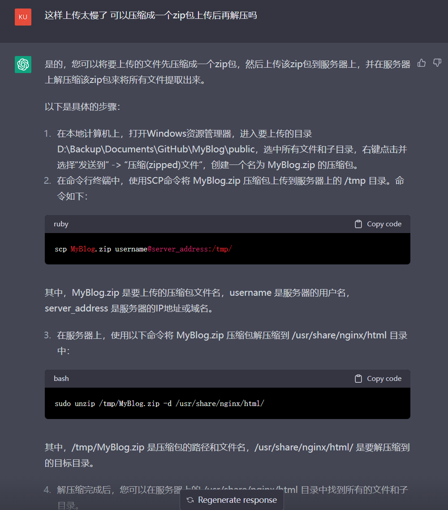

# 如何在国内注册ChatGPT账号

> 注意：此文章应用场景适合中国大陆、香港和澳门，其他地区的读者可以跳过这个文章。
>
> Note: This article is intended for readers in mainland China, Hong Kong, and Macau. Readers in other regions can skip this article.
>
> 对文章有任何疑问可以提issue或者联系我邮箱：zhaoweihao.dev@gmail.com

# 前言

最近ChatGPT真的是太火了，基本上大家都知道ChatGPT是什么了，我就不介绍了，但是大部分人在国内都是无法正常访问ChatGPT的，由于美国的出口管制导致ChatGPT不在国内提供服务，包含香港和澳门。加上最近ChatGPT放出了他们的最新的API model:gpt-3.5-turbo，作为互联网人不可能不去了解，不然就是跟国际脱轨了。

我最近已经在用ChatGPT帮助我编程，翻译，搭建博客；用下来还是非常有帮助的，但是他有个缺点就是训练的数据是到2021年的，所以对于一些时事的内容还是建议google，但是非时事的内容我觉得ChatGPT都能胜负了，有人问不是已经有google了吗，为什么还需要chatGPT，可以给大家提供一个例子：

在这个例子中我咨询他一个关于上传本地博客文件到远端服务器的问题，我给他提供了我本地的路径和远程路径，同时我还希望用zip包方式上传后再解压节省时间，他能通过我提供的内容总结好linux脚本给我，而且用起来一点问题都没。如果用google，我得自行搜索和筛选，选完后还得自己编写脚本，用的时间上肯定是更多的。这样的例子是数不胜数的，加上我已经在工作中使用上chatGPT了，能省下不少时间，可以准时下班回家啦。

# 开始

好的，废话不多说了进入正题。以下用GPT代称ChatGPT。

## 准备一个翻墙代理：

如果没有代理的可以参考我这篇文章去配置一个科学上网:https://github.com/zhaoweih/Shadowsocks-Tutorial

因为GPT封了中国区，所以首先得准备一个科翻墙代理，切换到非大陆和香港节点。

配置好后可以到https://whoer.net/zh 这个网站查看你当前的IP是不是国外的

## 准备一个国外的接码平台：

https://sms-activate.org/cn

因为现在国内的手机号是不能注册GPT的，所以需要一个国外的接收验证码的平台，这里我推荐https://sms-activate.org/cn

因为这个平台可以接受支付宝付款。大概2.06人民币左右接一个码，突然感觉淘宝那些卖号的几十块还是共享号的商家真是含泪赚了你的钱。

### 1.充值

注册账号后点击充值

选择支付宝

充值1美元就够了

### 2.接收验证码

在左边输入"openai"，然后选择印度尼西亚

然后复制平台给你的号码(注意：这个页面先不要关闭，后面会有用)

## 注册ChatGPT账号：

https://chat.openai.com/auth/login

打开https://chat.openai.com/auth/login 官网后点击右边的Sign Up注册账号

输入账号密码，最好用国外的邮箱

然后到邮箱验证下后，填写名字

接着来到最重要的一步，验证手机号，选择印度尼西亚,记得去掉前面的国家区号62，WhatsApp那里选择NO就好

最后到接码平台输入下验证码就可以

最后注册成功啦，Enjoy it!

预告：下一篇会说ChatGPT api的调用

## Buy ME a Coffee💴 (Alipay HK or 支付宝)

------

转载请标注原文链接
