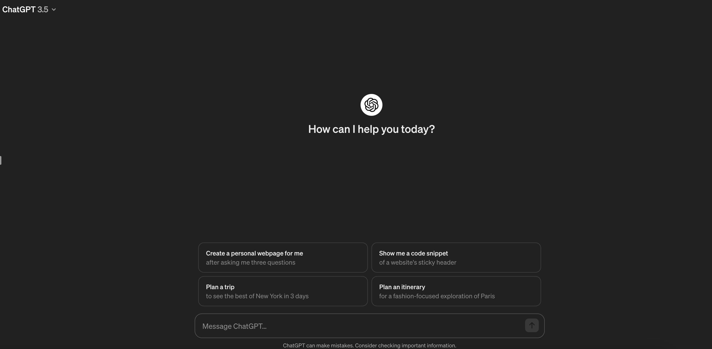

# 如何在国内注册ChatGPT账号

> 对文章有任何疑问可以提[issue](https://github.com/zhaoweih/ChatGPT-in-China/issues)或者联系我邮箱：zhaoweihao.dev@gmail.com
>
> 如果需要ChatGPT Plus合租的小伙伴可以到这里上车：https://universalbus.cn/r?s=OWKBr5bts6eR

# 开始

## 准备一个翻墙代理：

因为ChatGPT封了中国区，所以首先得准备一个翻墙代理，切换到**非香港区**节点。

如果没有代理的可以参考我这篇文章去配置一个科学上网:https://github.com/zhaoweih/Shadowsocks-Tutorial

配置好后可以到https://whoer.net/zh 这个网站查看你当前的IP是不是国外的

## 🔔最新2024年3月6日测试注册ChatGPT已经无需手机号验证，只需要国外邮箱即可

## 注册ChatGPT账号：

打开https://chat.openai.com/auth/login 官网后点击右边的Sign Up注册账号

输入账号密码，最好用国外的邮箱

然后到邮箱验证下后，填写名字

最后注册成功啦，Have fun with ChatGPT!

# 讨论

## DC群

**我创建了一个Discord群，遇到问题的小伙伴可以一起讨论**

